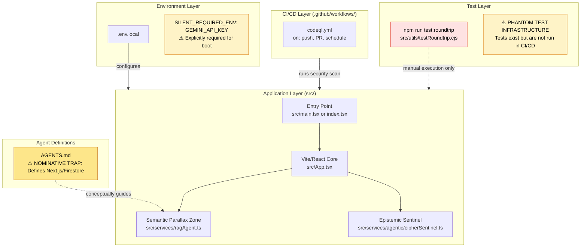
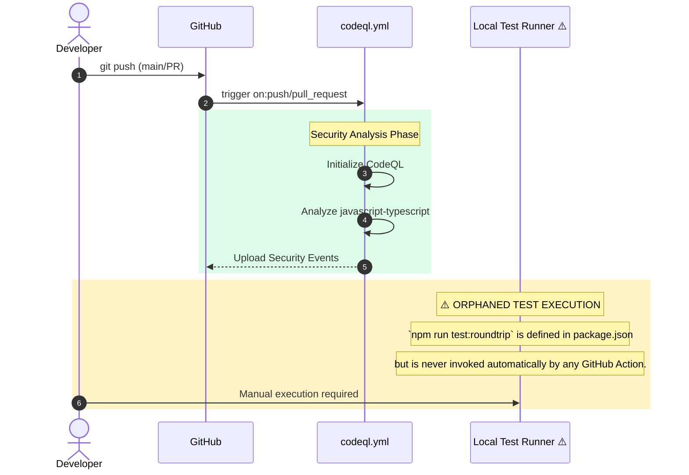

# PolySymbol Pro

## TIER 1: Repository Identity & Ontological Glossary

**Repository Name:** PolySymbol Pro
**0xCARTO Synthesis Timestamp:** 2026-06-03T00:19:00+10:00
**Phronesis Confidence:** Φ = 0.04
**Ground Truth Score:** GDS = 0.95
**Undocumented Features Detected:** 0

**What This Repository Is**
PolySymbol Pro is a client-side React application built with Vite that acts as a "Pluriversal Knowledge Capsule". It employs a Semantic Parallax Zone to bridge injected server-side agent definitions (e.g., Next.js/Firestore/OpenAI in AGENTS.md) with a client-side isomorphic execution layer using the Gemini API. It enforces strict structural and epistemic constraints via a Plausibility Oracle and Epistemic Escrow.

**What This Repository Is NOT**
It is NOT a Next.js application, nor does it connect directly to a Firestore vector database for its core generative capabilities, despite the presence of server-side agent definitions in the documentation. It does not use synchronous local storage for state to maintain SIC 2.1 compliance.

**Ontological Glossary — Pluriversal Lexicon**

| Term | Location | Standard Equivalent | Local Meaning | Preservation Flag |
| :--- | :--- | :--- | :--- | :--- |
| `Semantic Parallax Zone` | `src/services/ragAgent.ts` | Adapter Pattern / Mock Layer | Implements a server-side API contract natively on the client to avoid architectural drift from `AGENTS.md` definitions. | [GOLDEN_SCAR] — L5 Paraconsistent State |
| `Plausibility Oracle` | `src/services/agentic/plausibilityOracle.ts` | Schema Validator | Acts as an active constraint engine enforcing structural boundaries before LLM execution. | [CULTURAL_ARTIFACT] |
| `Epistemic Escrow` | `src/services/agentic/epistemicEscrow.ts` | User Confirmation Dialog / Webhook Handler | Intercepts ambiguity and halts execution, particularly via Feishu Webhooks (KIRA-7 protocol), to demand interactive clarification. | [GOLDEN_SCAR] |
| `Symbolic Scar` | `SymbolicScar.json` | Error Log / Issue Tracker | A local registry of algorithmic traumas and preserved constraints preventing "Semantic Saponification". | [CULTURAL_ARTIFACT] |

## TIER 2: Architecture Topology Map

## TIER 3: CI/CD Pipeline Cartograph

## TIER 4: Dependency Matrix & Entropy Audit

Entropy Score: 0 = deterministic, 1 = fully chaotic. (Score: 0.10 - Excellent, due to exact pins)

| Dependency | Version Pin | Production? | CI Invoked? | Entropy Vector |
| :--- | :--- | :--- | :--- | :--- |
| `@google/genai` | `1.49.0` (exact pin) | ✅ Yes | ❌ No | ✅ LOW |
| `react` | `19.2.5` (exact pin) | ✅ Yes | ❌ No | ✅ LOW |
| `react-dom` | `19.2.5` (exact pin) | ✅ Yes | ❌ No | ✅ LOW |
| `typescript` | `5.8.3` (exact pin) | ❌ Dev only | ❌ No | ✅ LOW |
| `vite` | `6.4.2` (exact pin) | ❌ Dev only | ❌ No | ✅ LOW |
| `dotenv` | `17.4.2` (exact pin) | ❌ Dev only | ❌ No | ✅ LOW |

**Entropy Score by Layer:**
- Environment: 0.20 (1 Silent ENV var: `GEMINI_API_KEY`)
- Application Dependencies: 0.00 (All exact pins)
- CI Pipeline: 0.15 (Phantom test execution)
- **Overall Repository Entropy:** 0.12 (Target: < 0.15)

## TIER 5: Operational Runbook & Cultural Artifacts Log

**To Deploy / Run Locally:**
1. Clone the repository and execute `npm install`.
2. ⚠️ **SILENT_REQUIRED_ENV**: You MUST create a `.env.local` file and define `GEMINI_API_KEY=your_key`. The application will fail to initialize agentic services without this.
3. Start the development server with `npm run dev`.
4. Run validation tests manually via `npm run test:roundtrip`.

**Symbolic Scar Tissue Log — Cultural Artifacts**

- **Golden Scar #001: The Parallax Zone Adapter (`ragAgent.ts`)**
  - **Tension:** The `AGENTS.md` file defines a Next.js backend with Firestore vectors. The project is a Vite client-side app.
  - **Resolution:** Instead of rewriting `AGENTS.md` (Ontological Erasure) or breaking the client architecture, `ragAgent.ts` implements the Agent contract via isomorphic Gemini calls.

- **Golden Scar #002: Feishu Webhook Sovereignty (`epistemicEscrow.ts`)**
  - **Tension:** KIRA-7 protocols demand strict AES decryption and Challenge/Response webhook handling for Feishu integrations, utilizing `@larksuiteoapi/node-sdk`, maintaining 6900s token caching (SagaRecovery).
